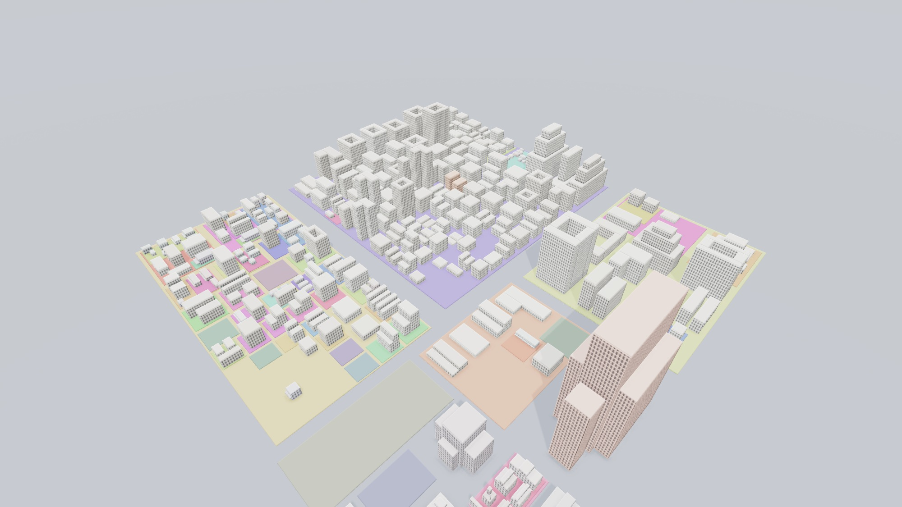
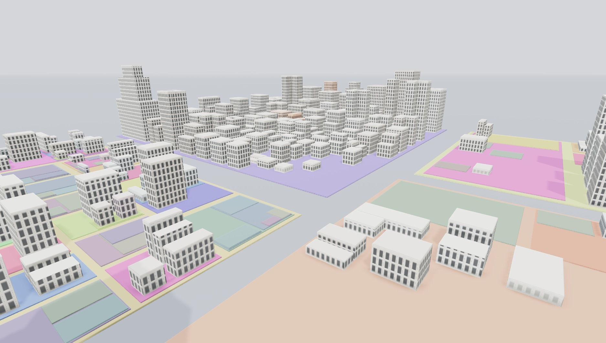

# 🏙️ CodeCity — a repo as a city that grows over its commit history

Render any Git repository as a 3D city. **Each building is a file**; it **grows
taller as the file gains lines of code**, rises out of the ground when the file
is first added, and sinks when it's deleted — all replayed across the repo's
commit history on a scrubbable timeline.



Inspired by [grahambrooks/codecity](https://github.com/grahambrooks/codecity),
but rebuilt on a MERN stack and — crucially — with the **commit-history growth
timeline** that the original doesn't have.

## How it works

```
Frontend (Vite + Three.js)          Backend (Node + Express)         Data
────────────────────────────        ──────────────────────────       ──────────
 scene.js   3D stage                  POST /api/analyze  ──┐          MongoDB
 city.js    buildings + growth        GET  /api/job/:id    │          (optional
 timeline.js play / scrub / speed     GET  /api/health     │           cache)
 ui.js      tooltip / legend / HUD                         │
      ▲                                                    ▼
      └──────── City Timeline JSON ◄──── engine/  git log --numstat replay
```

### The core trick

Instead of reading files off disk (which can only ever see the *current*
state), the engine replays the whole history in **one pass**:

```
git log --reverse --no-renames --numstat --pretty=format:@@C@@%H%x1f%at%x1f%an
```

`--numstat` gives `added / deleted / path` per file per commit. Folding
`added − deleted` cumulatively reconstructs **every file's line count at every
commit** — so the city can grow over time without ever checking out a commit.

The city layout is a **squarified treemap** computed once from the union of all
files that ever existed, so buildings grow *in place* instead of teleporting as
the file set changes.

## Reading it as a plan, not a pile of boxes

The city is drawn the way an urban planning diagram is, because that's what
makes it legible at a glance:

- **Zoned ground.** Every folder is painted as a coloured plate under its
  buildings, nested by depth — so you read *structure* before you read any
  single file. Zones whose files have all been deleted grey out to cleared
  land, which turns "empty slab of colour" into a story about the repo.
- **A street grid.** The treemap leaves a gap around every building and a wider
  one around every district, and the base plane is road-coloured, so the gaps
  become streets. Shallow folders get the wide avenues.
- **Outlined parcels.** A shader traces a darker border on every face and
  lightens the roofs, derived from the box's own UVs and normal — so it costs
  nothing and still works with instancing.
- **Building archetypes.** Buildings aren't all one box. Twelve massing types
  live in `shapes.js`, each authored inside the same unit cube out of
  axis-aligned boxes, and each is its own `InstancedMesh` — so **twelve shapes
  cost twelve draw calls**, not one per building.
- **Building type encodes file type.** A city isn't only offices, and a repo
  isn't only source code. The *language* picks which stock a file draws from,
  so districts read as neighbourhoods:

  | File kind | Becomes | Stock |
  |---|---|---|
  | Source code | commercial | slab, twin, stepped, L-shape, courtyard, podium+tower, setback tower |
  | Markdown / docs | civic | church (nave + campanile), civic hall (wings + portico) |
  | YAML, JSON, TOML, SQL | works | depot (roof monitor), utility plot (tank + mast) |
  | CSS, SCSS, HTML | retail | shop parade with a projecting canopy |
  | Everything else | misc | ordinary small stock filling the gaps |

  Within a kind, form still follows size — tiny files stay simple sheds
  (complex massing on a 2-unit footprint is just noise) and only genuine
  landmarks get towers.
- **Procedural facades.** The same shader models each wall as structural
  *bays*: a pale pilaster strip, recessed glazing between each pair, and a
  floor-slab line at every storey, plus a solid plinth at street level and a
  parapet on top. That vertical rhythm is what makes an extrusion read as
  architecture rather than a patterned box. Both rhythms are measured in
  *world* units, not UVs, so every building shares one storey height and one
  bay width — a big file reads as a tower, a small one as a shed, and nothing
  stretches. Anchoring to world Y also means the facade stays put as a
  building grows on the timeline: new storeys stack on top instead of the
  whole thing rescaling. Facades fade out below ~2 storeys and at distance,
  which is free LOD.
- **Model-white finish.** Buildings are finished like an architectural scale
  model, so massing and facade rhythm carry the eye. The language hue survives
  only as a faint tint — saturated at city scale it glares and flattens
  everything nearby, and the district plates underneath already carry the
  colour coding.

### What stops it looking like boxes

Four things, in order of how much each one buys:

| Technique | Why it matters |
|---|---|
| **Ambient occlusion** (`GTAOPass`) | Darkens where buildings meet the ground and where wings meet each other. This contact shading is what makes massing read as *solid* rather than as decals floating on a plane — the single biggest win. |
| **Window reveals** | Real walls have thickness. The shader shades the head and one jamb of every opening, so glazing sits *in* a reveal. A window with no reveal is a decal, and it's the clearest tell that a building is fake. |
| **Real material response** | A pre-filtered environment probe plus per-fragment roughness/metalness: glazing goes smooth and slightly metallic so it reflects something, masonry stays rough. Without an environment, low roughness renders as flat tinted paint. |
| **Chamfered edges** | Perfectly sharp corners read as CG. Each face lifts its top/left border and darkens its bottom/right, which reads as a bevel from any angle without adding a single triangle. |

AO sampling is deliberately low (6/6 rather than 16/16). At city scale AO is
broad contact shading, not fine detail, and the denoise pass hides the reduced
sampling — full sampling cost **3x the frame time for no visible difference**
(69 fps → 215 fps, images indistinguishable).

> **Gotcha worth knowing:** the renderer's `antialias: true` only applies to the
> default framebuffer. The moment you render through an `EffectComposer` the
> image lands in a render target instead and antialiasing is *silently lost* —
> edges turn jagged and no error tells you why. The fix is to hand the composer
> an explicitly multisampled `WebGLRenderTarget` (`samples: 4`).


- **A tone-mapped palette.** GitHub's language colours are tuned for tiny dots
  on a white page; dropped onto city-sized surfaces the bright ones (JavaScript
  yellow especially) glare and flatten everything nearby. Colours are squeezed
  into a narrow saturation/lightness band and nudged per file, so a district of
  400 JS files still reads as 400 distinct parcels.

## Scaling to real repos

Four things keep a decade-old repo smooth:

| Problem | Fix |
|---|---|
| Thousands of meshes = thousands of draw calls | All buildings live in **one `InstancedMesh`** → **4 draw calls total**, whatever the file count |
| A million-commit scrubber is unusable, and the payload explodes | The timeline is **one frame per commit** — the repo's real history. Sampling only kicks in past 12,000 commits as a backstop, and resamples so every frame (and the final state) stays exact. `expressjs/express` replays all 6,158 commits at 145 KB gzipped. |
| `git log` on a huge repo emits hundreds of MB | The log is **stream-parsed line by line**, never held in memory |
| City JSON is large and repetitive | **gzip** on the wire, and cached in Mongo gzipped (dodging the 16 MB document cap) |

Measured on `expressjs/express` (6,158 commits → 829 buildings):
**0.3 ms/frame**, 4 draw calls, payload **719 KB → 54 KB** gzipped.

**Land goes to the survivors.** Lots are sized by how much of the timeline a
file actually occupied, and heavily discounted if the file is gone by the end.
Without that, a repo that deleted most of its files spends most of its map on
empty ground — `expressjs/express` keeps only 241 of 869 files, and an even
allocation left it **50% vacant** at HEAD. Weighting toward survivors brings
that to **19%**, which reads as parks and yards rather than an abandoned plan.

**Don't paint every folder.** Deep nesting produces a lot of one-file
directories whose zones are a few units across; drawn, they scatter the map
with confetti instead of describing its structure. Only zones at depth ≤ 3 and
above a minimum area get ground colour — 195 plates down to 57 on Express.

**Sample sparingly.** An early version capped the timeline at 600 frames, which
looked harmless until you watched a real repo: most projects create the bulk of
their files in their first handful of commits, and compressing 1,354 commits
into 600 frames fused those into a single step. The city appeared to snap into
existence at frame 1 and then sat still for 400 frames. The cap is a backstop
for pathological histories, not a default — keep it high.

**Stagger births in the animation, never in the data.** A commit that adds 60
files is a real thing that happens (an initial scaffold does exactly that), and
raising all 60 in unison reads as one slab heaving out of the ground. Each
building gets a deterministic sub-second offset before it starts growing, so
the same commit lands as a run of individual buildings going up. Dragging the
scrubber clears the offsets, because someone scrubbing wants the state under
their cursor immediately.

## Run it

**Requirements:** Node 18+, Git. MongoDB is optional (used only to cache
analyzed repos; the app runs fine without it, and cache failures fall back to
re-analysis rather than erroring).

```bash
# Optional: MongoDB for caching (cold 3.8s -> warm 0.27s on express)
docker run -d --name codecity-mongo -p 27017:27017 mongo:7
```

```bash
# 1) Backend  (terminal 1)
cd backend
npm install
npm start                 # -> http://localhost:3001

# 2) Frontend (terminal 2)
cd frontend
npm install
npm run dev               # -> http://localhost:3000
```

Open **http://localhost:3000**, type a repo (`owner/repo` or a full
`https://github.com/...` URL), and press **Build city**. Press ▶ to watch it grow.

### Try the engine on its own

```bash
cd backend
node engine/cli.js <path-to-a-local-git-repo> city.json
```

Prints a summary and writes the City Timeline JSON.

## API

| Method | Endpoint          | Description                                  |
|--------|-------------------|----------------------------------------------|
| GET    | `/api/health`     | `{ status, db }`                             |
| POST   | `/api/analyze`    | `{ repo }` → `{ city }` (cached) or `{ jobId }` |
| GET    | `/api/job/:id`    | `{ status, message?, city?, error? }`        |

## Project layout

```
backend/
  engine/        analyze.js · layout.js · languages.js · buildCity.js · cli.js
  lib/repo.js    parse repo input + clone (--no-checkout)
  models/City.js Mongoose cache model
  db.js          optional Mongo connection
  server.js      Express API + async job runner
frontend/
  src/           scene.js · city.js · timeline.js · ui.js · api.js · main.js
  public/city.json  bundled demo city (the codecity repo itself)
site/
  index.html     landing page — no build step, no dependencies
  style.css      layout, theming, and every animation
  script.js      city generator, replay, scroll reveal, stat counters
```

## The landing page

`site/` is a standalone marketing page for the project — plain HTML and CSS
with a little vanilla JavaScript, sharing the app's palette so the two read as
one product. The hero contains a miniature city that builds itself one building
at a time, mirroring what the real timeline does.

It has no build step. Open `site/index.html` directly, or serve it:

```bash
python -m http.server 4300 --directory site
```

## Roadmap

- [x] History-replay data engine
- [x] Stable squarified-treemap layout
- [x] 3D city render (Three.js)
- [x] Commit-growth timeline (play / scrub / speed)
- [x] Express + MongoDB backend, paste-a-URL flow
- [x] Scale: instancing, commit sampling, streaming parse, gzip
- [ ] Author view (color by who edits) & richer heat trails
- [ ] Shareable permalinks, export to GIF
